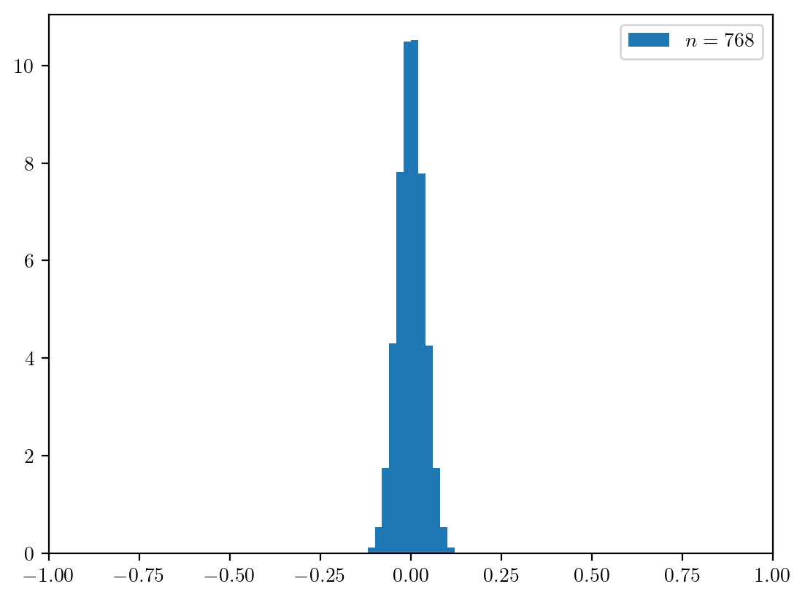

---

marp: true
math: mathjax
style: |
  /* 三重引用を脚注の記号に転用 */
  /* 下記はdefaultテーマ用。他のテーマで利用するときはbottomとleftを調節してください。 */
  /* スライド全体で利用するため、無名のstyleタグを利用しています。 */
  blockquote > blockquote > blockquote {
    font-size: 75%;
    font-weight: 400;
    padding: 0;
    margin: 0;
    border: 0;
    border-top: 0.1em dashed #555;
    position: absolute;
    bottom: 70px;
    left: 70px;
    width: 89%
  }

---

# 位置エンコーディング周りの諸検証

#### 情報数理システム分野 B4

### 平田蓮

---

## 目次

- **既存のモデルから位置エンコーディングを除去**
  - Encoderモデル（BERT）
  - Decoderモデル（GPT-2）
- **Decoderモデルの位置エンコーディングをAttentionマスクで代用**
- **展望**

---

## 位置エンコーディングを除去

位置エンコーディングが実際にどれほど重要なのかを調査

2種類のモデルで調査
- Encoderモデル（BERT）: 入力シーケンスを特徴量に変換
- Decoderモデル（GPT-2）: 入力シーケンスに対して、（続く）トークンを生成

評価用のデータセットはIMDB[1]を起用。文章の2値分類データ

>>> [1] https://ai.stanford.edu/~amaas/data/sentiment

---

## BERTの位置エンコーディングを除去

BERT-baseの構造

- 入力 $\boldsymbol{x}$ - トークンのシーケンス（ $x_1, x_2, \cdots x_n$ ）
- 出力 $\boldsymbol{y}$ - トークンごとの特徴量のシーケンス（ $\boldsymbol{y}_1, \boldsymbol{y}_2, \cdots \boldsymbol{y}_n$ ）
  - 特徴量の次元は768（ $\boldsymbol{y}_i = \{y_{i, 1}, y_{i, 2}, \cdots y_{i, 768}\}$ ）
  - 特徴量は正規化される
- 埋め込み機構 - 各トークンを768次元の埋め込みに変換 $\mathbb{R} \rightarrow \mathbb{R}^{768}$
  - 単語埋め込み: トークンを表す添字を768次元のベクトルに変換
  - **位置埋め込み**: 位置を表す添字を768次元のベクトルに変換
  - これらの埋め込みを加算して、Encoderに与える
- Encoder機構 - Headを12個のMulti-Head Attentionのブロックが12層 $\mathbb{R}^{768} \rightarrow \mathbb{R}^{768}$

---

## BERTの位置エンコーディングを除去

位置埋め込みの値を0にして加算しても影響がないように

- 位置埋め込みあり・なしのBERTの特徴量同士のコサイン類似度を算出
- これが高かったら位置埋め込みなしでも同様の情報を持った特徴量ができる
  - **要議論**

---

## BERTの位置エンコーディングを除去

- 位置埋め込みあり・なしのモデルでテストデータに対して特徴量を生成
- 各トークンの特徴量同士のコサイン類似度を算出
- データ全体で平均を取る

**結果: 0.7702**

---

## BERTの位置エンコーディングを除去

コサイン類似度0.7702は高いのか

- サンプリングで768次元のベクトルのコサイン類似度の分布を見てみる
- 平均が$\boldsymbol{0}$、分散共分散行列が単位行列の多次元正規分布の密度関数は、
    $$
        \frac{1}{Z}\exp\left(-\frac{1}{2} {}^t\boldsymbol{x}\boldsymbol{x}\right) = \frac{1}{Z}\exp\left(-\frac{1}{2} \|\boldsymbol{x}\|^2\right)
    $$
    なので、正規分布を用いたら方向について一様にサンプリングできる

---

## BERTの位置エンコーディングを除去

コサイン類似度0.7702は高いのか - 結果

高そう（少なくとも位置埋め込みを抜いたらランダムになってしまうとかではない）

---

## BERTの位置エンコーディングを除去

- 低くはないコサイン類似度が得られた
- 位置埋め込みを抜いた特徴量が実際にどれくらい使えるのかは、**下流タスクのモデルを学習して評価する必要あり**

---

## GPT-2の位置エンコーディングを除去

GPT-2の構造

- GPT-2はCausal LM（因果推論）のモデル
  - 入力シーケンスに対して、続くトークンを推論
- 入力 $\boldsymbol{x}$: トークンのシーケンス（ $x_1, x_2, \cdots x_n$ ）
- 出力: 各トークンの生成確率
  - GPT-2は50257種類のトークンを扱う（50257変数の離散確率分布）
- 埋め込み、Decoderの内部構造はBERTと類似
- 出力層 - 特徴量を生成確率分布に変換 $\mathbb{R}^{768} \rightarrow \mathbb{R}^{50257}$

---

## GPT-2の位置エンコーディングを除去

BERTと同様に、位置埋め込みを0にする
- 位置埋め込みあり・なしの生成確率のPerplexityを評価
    Perplexityは因果推論モデルの流暢さを評価: $\mathrm{Perplexity = 2^{Cross Entropy}}$
- 各トークンのPerplexityの平均を全データ取り比較
- Decoderの出力特徴量も、コサイン類似度をBERTの際と同様に算出

---

## GPT-2の位置エンコーディングを除去

結果

コサイン類似度: 0.9291

| モデル | Perplexity |
| :- | -: |
|位置埋め込みあり|111.2409|
|位置埋め込みなし|712014.3125|

---

## GPT-2の位置エンコーディングを除去

- うまく推論できない
- （おそらく）因果推論タスクは次のトークンを推論するため、トークンの位置情報が重要
- コサイン類似度はBERTのときより高いので、BERTの下流タスクも厳しいのかもしれない
  - ただ、直感では文書分類などの下流タスクは位置情報の優先度は低そう

---

## 位置エンコーディングをAttentionマスクで代用

位置エンコーディングの除去可能性を模索

- 因果推論モデルでは位置埋め込みをなくすとうまく推論ができなかった
- 位置埋め込みをなくす代わりに、Attentionマスクに位置情報を持たせられないか

評価用データセットはTruthfulQA[2]を起用。入力文章に対する解答生成データ

>>> [2] S. Lin, et al., "TruthfulQA: Measuring How Models Mimic Human Falsehoods", arXiv:2109.07958, 2022

---

## 位置エンコーディングをAttentionマスクで代用

Attentionマスクとは

- 因果推論モデルでは、参照できるトークンを示すためにマスクが与えられる
- [因果, 推論, モデル, で, は, 、, 参照, でき]というデータを学習する時に、シーケンスの始めから学習
- [因果, 推論, モデル]の次の「で」を学習する際は、「で」以降のトークンについてはAttentionを計算したくない
- [1, 1, 1, 0, 0, 0, 0, 0]というマスクを与える

---

## 位置エンコーディングをAttentionマスクで代用

仮説

- GPT-2の位置埋め込みは加算される（事実）
  - 埋め込みのノルムに位置情報が乗っている可能性
    - **要調査**
- マスクは埋め込みに乗算される（事実）
  - マスクでノルムを弄れば、位置情報にが乗る可能性

---

## 位置エンコーディングをAttentionマスクで代用

実際に、マスクを変更してみる

- 前述の例では、[1, 1, 1, 0, 0, 0, 0, 0]
- [0.1, 0.55, 1, 0, 0, 0, 0, 0]のように、推論するトークンから離れるほどマスクの値が小さくなるように
- とりあえず、1から0.1にかけて線形で変化させる

---

## 位置エンコーディングをAttentionマスクで代用

結果

| モデル | Perplexity |
| :- | -: |
|位置埋め込みあり|111.2409|
|位置埋め込みなし・デフォルトマスク|712014.3125|
|位置埋め込みなし・線形マスク|11897.4824|

- 位置埋め込みには及ばないが、デフォルトマスクに比べてPerplexityが低下
- 擬似的な位置情報が乗り、推論性能が向上
  - **要調査**

---

## 展望

- **Encoderモデルにおける位置埋め込みの除去**
  - 下流タスクでの評価
    - **学習が必要**
  - 除去できたところで、有効性が特に見えていない
    - 計算量が落とせるとか......？
- **Decoderモデルの位置エンコーディングをAttentionマスクで代用**
  - 本当にマスクで位置情報が乗せられるのか調査
    - 調査方法が思い浮かんでいない
    - 先行研究も見つけられず
  - ↑の結果に基づいたより有用なマスクの考案